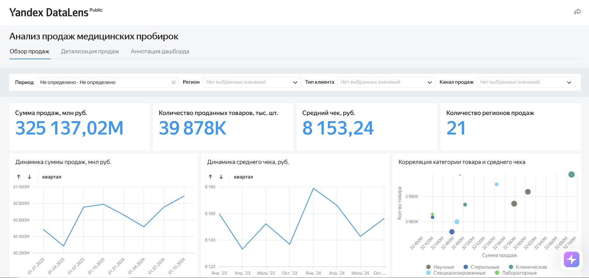

# Проект Дашборд продаж медицинских пробирок в DataLens

## Бизнес-контекст

Компания «ЛайфЛайн» занимается продажей медицинских пробирок различного назначения - для анализа крови, хранения мазков ПЦР и других задач. Директор отдела продаж инициировал разработку интерактивного дашборда, который позволит:

- руководству - отслеживать ключевые показатели отдела продаж и динамику бизнеса;
- менеджерам по работе с поставщиками и продажам - оперативно анализировать продажи в разрезе периодов, регионов, поставщиков, каналов и типов клиентов.

Данные хранятся в PostgreSQL и включают информацию о продажах, товарах, поставщиках, клиентах, каналах продаж и геоданные регионов.

## Цель проекта

Разработать многостраничный дашборд в Yandex DataLens, который закрывает потребности разных ролей пользователей: от обзорной аналитики до детализации продаж с возможностью сравнения периодов.

## Задачи проекта

### Вкладка «Обзор продаж»

- Создать панель фильтров, удобную для пользователя.
- Добавить индикаторы с ключевыми метриками отдела продаж:
  - сумма продаж;
  - количество проданных товаров;
  - средняя стоимость товара;
  - другие релевантные показатели.
- Построить чарты динамики:
  - динамика общей суммы продаж;
  - динамика средней стоимости товара;
  - с возможностью переключения детализации месяц / квартал.
- Составить рейтинг продуктов по количеству проданных единиц:
  - сортировка от самых продаваемых к наименее продаваемым;
  - цветовое выделение категорий.
- Визуализировать взаимосвязь объёма и суммы продаж по каждому продукту:
  - корреляция «количество ↔ сумма»;
  - указание категории продукта;
  - подпись со средним чеком.
- Показать структуру продаж поставщиков:
  - вложенная структура (продажи по типам клиентов внутри общих продаж поставщиков).
- Построить карту географии продаж:
  - все регионы с продажами;
  - сравнение регионов по общей сумме продаж.

### Вкладка «Детализация продаж»

- Создать панель фильтров, включая:
  - базовые фильтры (даты, регионы, поставщики);
  - выбор базового периода и периода сравнения.
- Визуализировать рейтинг категорий и продуктов по сумме продаж:
  - переключение между детализацией по категориям и по продуктам;
  - сортировка по убыванию.
- Показать изменение суммы продаж от базового периода к периоду сравнения:
  - условное форматирование с символами «+» / «−».
- Визуализировать рейтинг категорий и продуктов по количеству проданных единиц:
  - аналогичная настройка переключения и сортировки.
- Собрать таблицу с разбивкой по:
  - поставщикам;
  - каналам продаж;
  - типам клиентов;
  - суммой продаж за базовый и сравнительный периоды;
  - разницей в рублях и процентах;
  - условным форматированием изменений.

### Вкладка «Аннотация дашборда»

- Описать основные метрики дашборда с использованием Markdown:
  - списки, выделение, разделители, форматирование текста.
- Подготовить краткую аналитическую записку по данным дашборда.

## Стек технологий

- **Yandex DataLens** - построение дашборда, чартов, индикаторов, карт и фильтров.
- **PostgreSQL** - источник данных.
- **SQL** - подготовка и агрегация данных для визуализаций.
- **Markdown** - оформление аннотации и аналитической записки.

---

## Ключевые результаты

- Разработан **многостраничный дашборд** в DataLens с обзором продаж, детализацией и аннотацией.
- Реализованы:
  - интерактивные фильтры и переключатели детализации;
  - сравнение базового и отчётного периодов;
  - условное форматирование изменений;
  - карта географии продаж;
  - вложенная структура продаж по поставщикам и типам клиентов.
- Подготовлена **аналитическая записка** и описание метрик для пользователей дашборда.

